# Flutter Project: Automated Mess System

An Android application designed to simplify and automate mess calculations using **Flutter** and **MongoDB**.

## [Project Video](https://www.youtube.com/watch?v=8lhPqSfN3dw)

---

### Common View

1. **Home View**  
   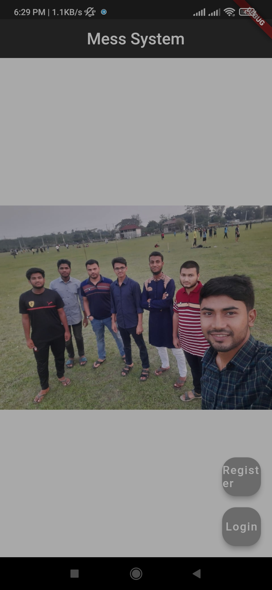
   
   Users can access general information and navigate through the app
   
3. **Sign Up**  
   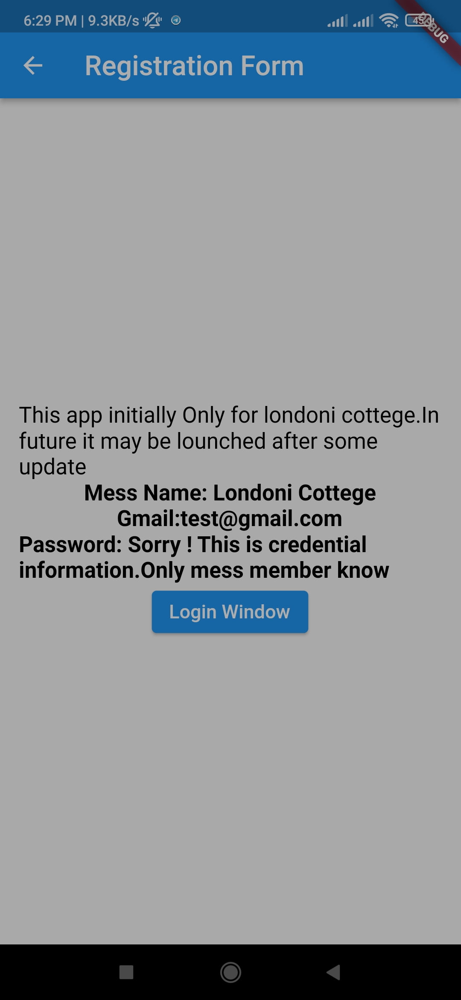
   
   New users can create accounts to join the system.
   
5. **Sign In**  
   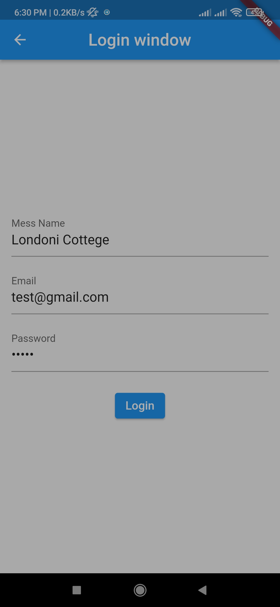
   
   Registered users can log in securely.  

---

### Member View   

1. **Deshboard**  
   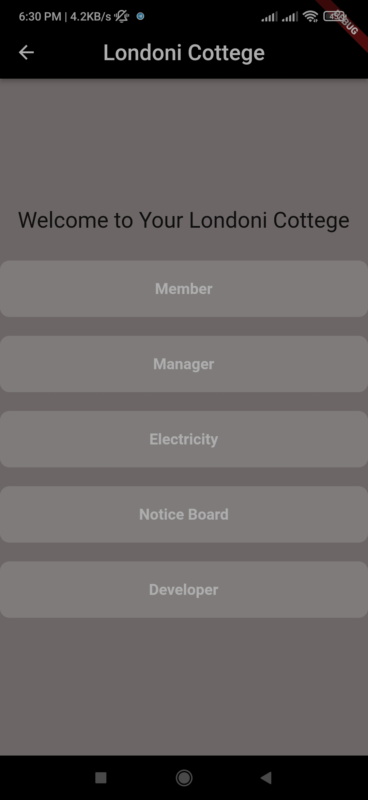
   
   A personalized view for members to monitor their activities.
   
3. **General Member**  
   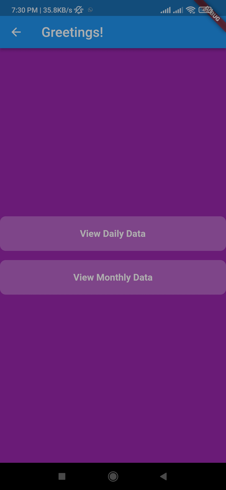
   
   Member personal deshboard.
   
5. **Daily Data**  
   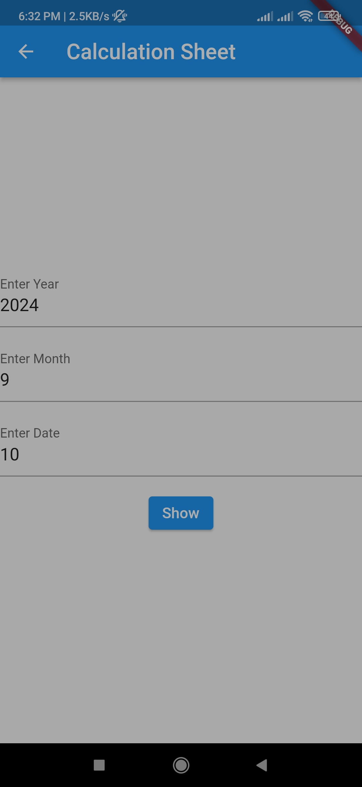
   
   Input for daily data.
   
7. **Result**  
   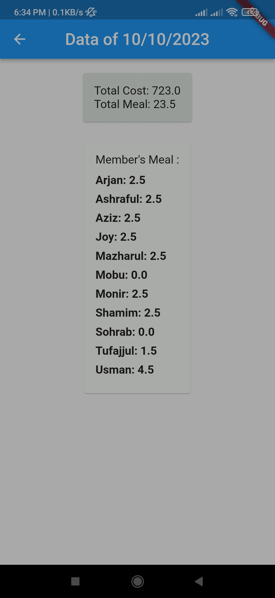
   
   View detailed calculations of daily mess expenses.
   
9. **Monthly Data**  
   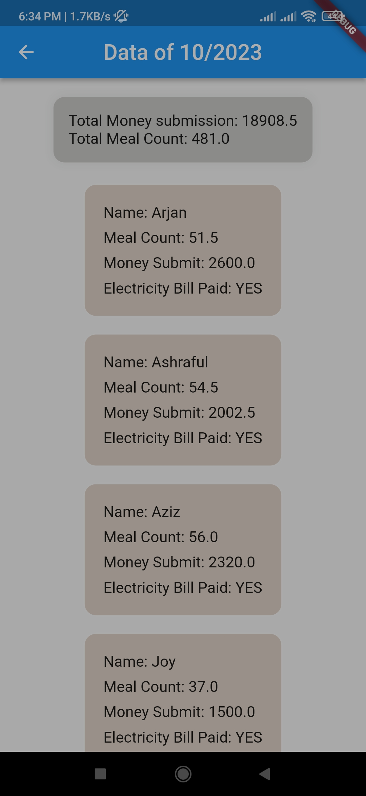
   
   Analyze monthly expenditure trends.
   
11. **Notice Board**  
   
   
   Stay updated with important announcements.

13. **Developer**  
   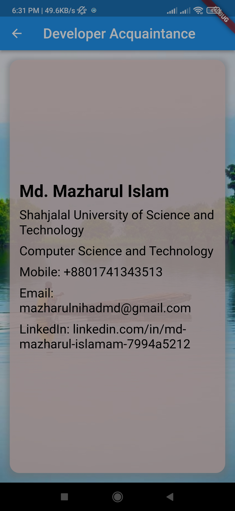
   
   View details about the developers behind the project.

---

### Manager View  

1. **Manager Login**  
   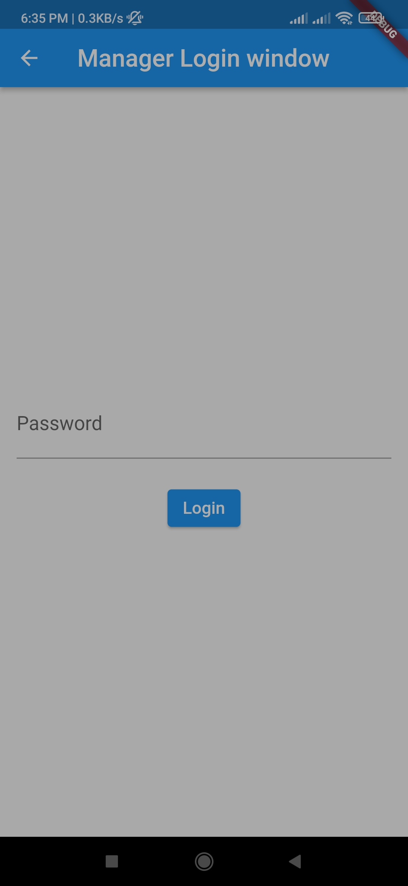  
   Secure login for managers to access administrative features.  

2. **Dashboard**  
   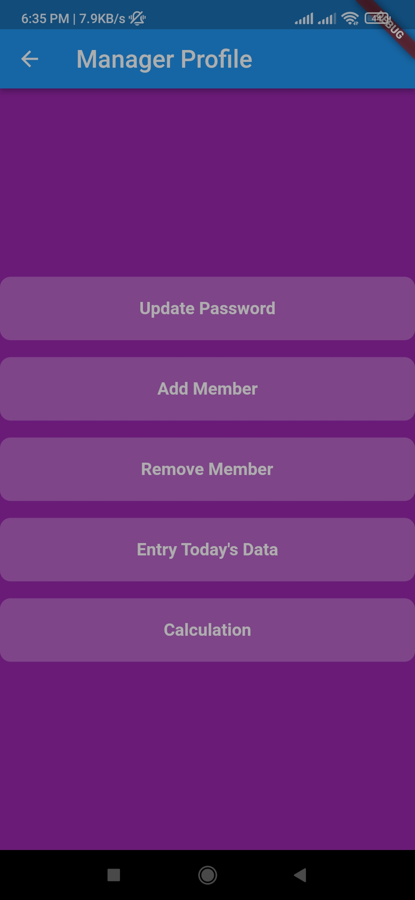  
   Manage mess operations effectively.  

3. **Update Password**  
   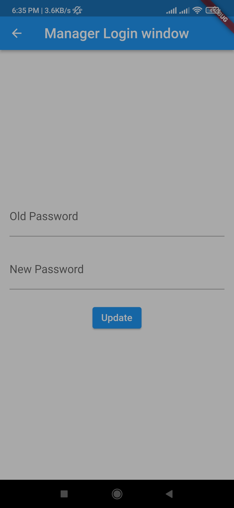  
   Update login credentials securely.  

4. **Add Members**  
   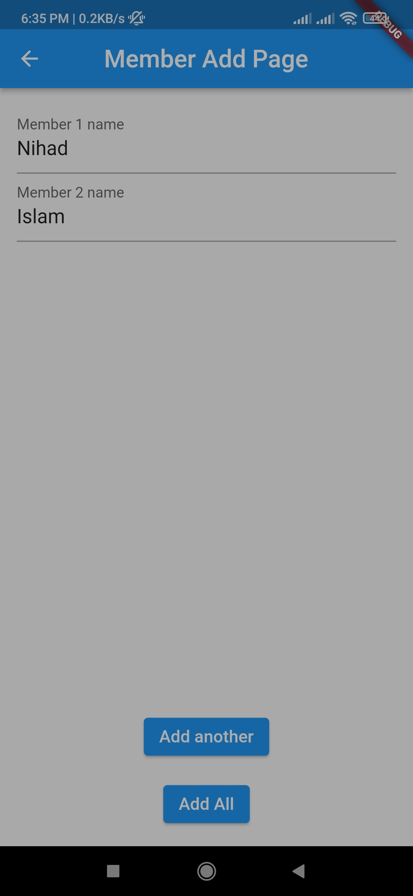  
   Add new members to the system.  

5. **Remove Members**  
   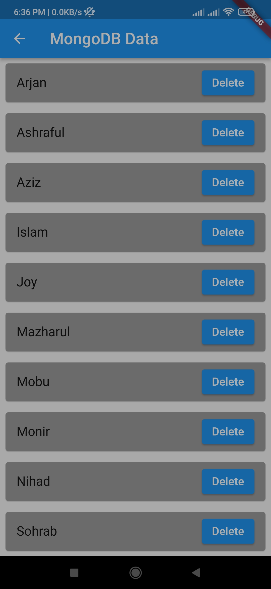  
   Remove members no longer part of the mess.  

6. **Daily Data Entry**  
   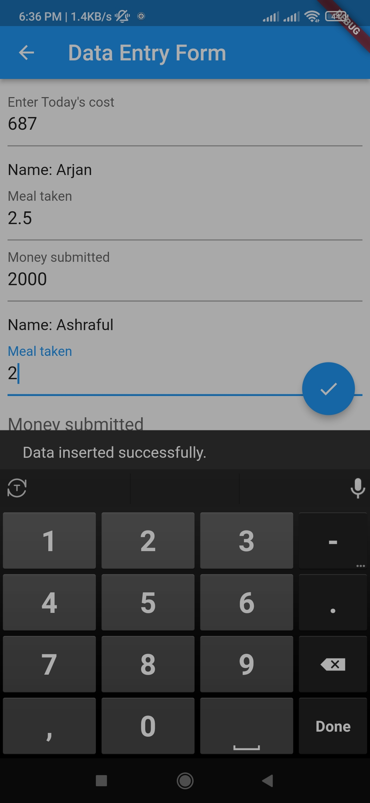  
   Input daily data for members.  

7. **Monthly Calculation Command**  
   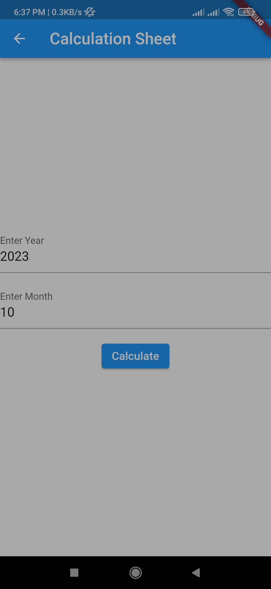  
   Automate monthly expense calculations.  

8. **Monthly Calculation Result**  
   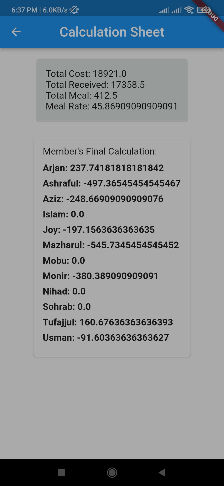  
   View summarized monthly calculations. 

---

### Electricity Manager View

1. **Login**  
   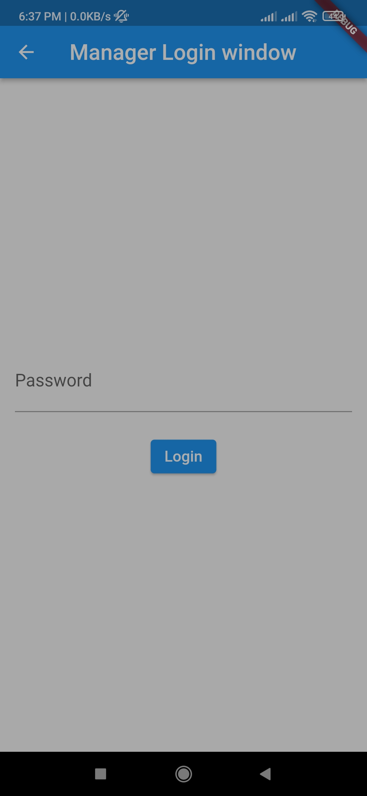  
   A dedicated interface for managing electricity-related tasks.  

2. **Dashboard**  
   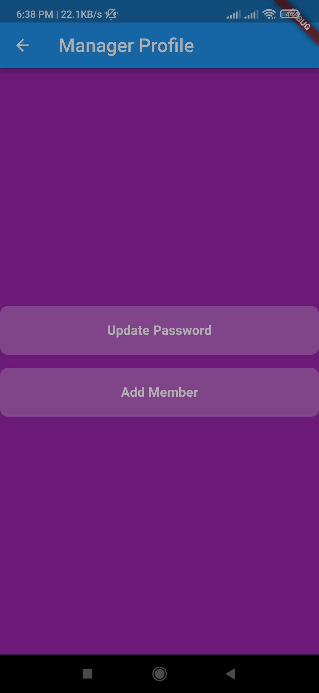  
   Monitor and configure electricity billing.  

3. **Configure Bill**  
   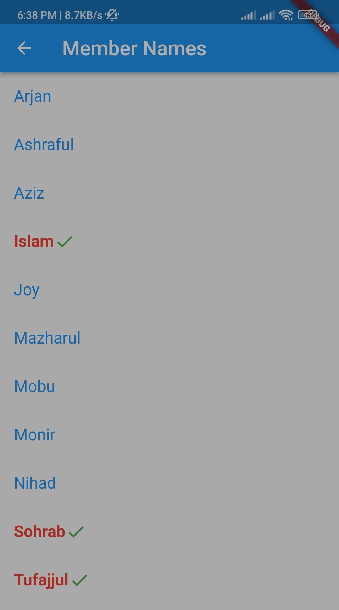  
   Manage electricity expenses seamlessly.
   
---

## Technology Stack  
- **Frontend:** Flutter  
- **Backend:** MongoDB  

---

## Contributions  
Contributions are welcome! Feel free to open issues or submit pull requests for new features or improvements.  

---

## Contact  
For further inquiries, feel free to reach out.  
